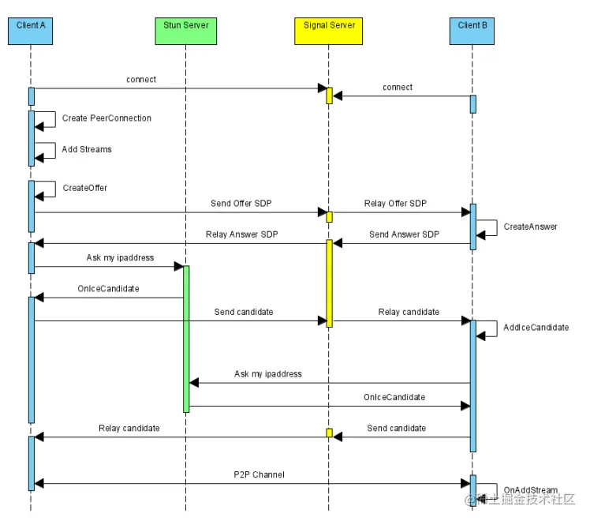

# webRTC 介绍

> MDN：  
> WebRTC（Web Real-Time Communications）是一项实时通讯技术，它允许网络应用或者站点，在不借助中间媒介的情况下，建立浏览器之间点对点（Peer-to-Peer）的连接，实现视频流和（或）音频流或者其他任意数据的传输。WebRTC 包含的这些标准使用户在无需安装任何插件或者第三方的软件的情况下，创建点对点（Peer-to-Peer）的数据分享和电话会议成为可能。

WebRTC提供了一套标准API，使Web应用可以直接提供实时音视频通信功能。大部分浏览器及操作系统都支持WebRTC，直接可以在浏览器端发起实时音视频通话。

## 音视频通信为什么选择webRTC

参考[音视频通信为什么要选择WebRTC](https://blog.avdancedu.com/b363212d/)。  
在webRTC开源之前，自研开发实时音视频的成本很高，需要考虑的因素也很多，音视频的编解码、各端的差异兼容、数据传输问题、网络问题等等。

## webRTC架构
### 架构图
  

[官方解读](https://webrtc.github.io/webrtc-org/architecture/)  

从webRTC架构图中你可以了解到，它大体上可以分成四层：即接口层、Session层、核心引擎层和设备层。 

1、接口层：包括两部分，一是Web层接口，二是Native层接口。也就是说，你既可以使用浏览器开发音视频直播客户端，也可以使用Native(C++、Android、OC等)开发音视频直播客户端。

2、Session层：主要作用是控制业务逻辑，如媒体协商、收集Candidate等，这些操作都是在Session层处理的；

3、核心引擎层：主要包括音频引擎、视频引擎和网络传输层。音频引擎层包括NetEQ、音频编解码器（如OPUS、iLBC)、3A等。视频引擎包括JitterBuffer、视频编解码器（VP8/VP9/H264)等。网络传输层包括SRTP、网络I/O多路复用、P2P等。

4、设备层：主要与硬件打交道，它涉及的内容包括：在各终端设备上进行音频的采集与播放、视频的采集以及网络层等

### 基础概念
#### NAT
> MDN：  
> 网络地址转换协议（Network Address Translation）用来给你的（私网）设备映射一个公网的 IP 地址的协议。一般情况下，路由器的 WAN 口有一个公网 IP，所有连接这个路由器 LAN 口的设备会分配一个私有网段的 IP 地址（例如 192.168.1.3）。私网设备的 IP 被映射成路由器的公网 IP 和唯一的端口，通过这种方式不需要为每一个私网设备分配不同的公网 IP，但是依然能被外网设备发现。
>
> 一些路由器严格地限定了谁能连接内网的设备。这种情况下，即使 STUN 服务器识别了该内网设备的公网 IP 和端口的映射，依然无法和这个内网设备建立连接。这种情况下就需要转向 TURN 协议。

因为目前互联网大部分部署的网际协议（IP 协议）版本是 IPV4，然而 IPV4 使用的是 32 位 2 进制的地址，能够产生 43 亿个 IP 地址，如果每一个用户终端都以独立的 IP 地址接入互联网，那么这 43 亿的地址将不够分。
所以目前的网络结构基本是多设备终端通过一层或多层的 NAT 代理接入到互联网中，也就是局域网。
#### STUN/TURN
> MDN STUN:    
> NAT 的会话穿越功能（Session Traversal Utilities for NAT） 是一个允许位于 NAT 后的客户端找出自己的公网地址，判断出路由器阻止直连的限制方法的协议。
> 客户端通过给公网的 STUN 服务器发送请求获得自己的公网地址信息，以及是否能够被（穿过路由器NAT）访问。

STUN协议允许客户端发现他们的公共 IP 地址和他们背后的 NAT 类型。此信息用于建立媒体连接。在大多数情况下，STUN 服务器仅在连接设置期间使用，一旦建立该会话，媒体将直接在对等方和视频网关 (WebRTC) 之间流动。  

国内免费可用的STUN服务器地址列表：https://www.cnblogs.com/onew/articles/10641979.html

#### ICE框架
webRTC的NAT穿透是一整个机制，我们管它叫ICE（Interactive Connectivity Establishment 交互式连接建立），是一个允许你的浏览器和对端浏览器建立连接的协议框架。在实际的网络当中，有很多原因能导致简单的从 A 端到 B 端直连不能如愿完成。这需要绕过阻止建立连接的防火墙，给你的设备分配一个唯一可见的地址（通常情况下我们的大部分设备没有一个固定的公网地址），如果路由器不允许主机直连，还得通过一台服务器转发数据。

#### 信令服务器

信令服务器就是webRTC之间传递消息的服务器，实现连接两端，主要作用就是各种转发。

- 让通信双方彼此交换网络信息
  - 最常见的是交换通信双方的IP地址和端口 - ICE Candidate
  - 两个WebRTC之间会尽可能选择P2P进行传输，同一个局域网内直接通过P2P进行传输，不同局域网内需要使用P2P穿越后进行数据传输，P2P穿越成功后直接传输，失败后进行中转等 - 后续的候选人中进行解说
- 通信双方交换媒体信息
  - 媒体信息用SDP来表示，这个SDP可以简单理解为：媒体类型的编码器是什么、是否支持该媒体类型和对应的编码器、编码方式是什么等
- 实现业务层管理
  - 如用户创建房间，加入房间，退出房间等
  - 确定何时初始化、关闭和修改通话会议，也可以进行错误报告
    

## 通信过程
### 生命周期
1. 发布端 通过 navigator.mediaDevices.getUserMedia() 采集本地媒体流
2. 发布端 创建一个RTCPeerConnection 并调用 RTCPeerConnection.addTrack() 添加媒体轨道
3. 发布端 调用 RTCPeerConnection.createOffer() 来创建一个媒体描述信息（offer）.
4. 发布端 调用 RTCPeerConnection.setLocalDescription() 将offer设置为本地描述
5. setLocalDescription() 之后，发布端 请求 STUN 服务创建 ice 候选人列表 (ice candidates)
6. 发布端 通过信令服务器将offer和ice信息发送给本次呼叫的接收端
7. 接收端 创建一个 RTCPeerConnection 实例,并且绑定ontrack监听事件
8. 接收端 收到了offer信息并调用 RTCPeerConnection.setRemoteDescription() 将其记录为远程描述 (也就是连接的另一端的描述)
9. 接收端 通过 RTCPeerConnection.createAnswer() 创建一个媒体描述消息（answer）。
10. 接收端 调用 RTCPeerConnection.setLocalDescription() 将answer设置为本地描述。此时，接收端已经获知连接双方的配置了。
11. 接收端 通过信令服务器将answer生成的offer以及ice信息传递到发布端。
12. 发布端 接受到消息后，调用 RTCPeerConnection.setRemoteDescription() 将应答设定为远程描述。如此，发布端 已经获知连接双方的配置了。

### 媒体采集
#### 媒体流（MediaStream）
[MediaStream](https://developer.mozilla.org/zh-CN/docs/Web/API/MediaStream) 接口用于表示媒体数据流。 流可以是输入或输出，也可以是本地或远程（例如，本地网络摄像头或远程连接）。 必须注意，单个 MediaStream 可以包含零个或多个轨道。 每个轨道都有一个对应的 [MediaStreamTrack](https://developer.mozilla.org/zh-CN/docs/Web/API/MediaStreamTrack) 对象，该对象代表用户代理中的特定媒体源。 MediaStream 中的所有轨道在渲染时进行同步。MediaStreamTrack 表示包含一个或多个通道的内容，其中，通道之间具有定义的已知的关系。 通道是此 API 规范中考虑的最小单位。 
#### 采集过程
> [MediaDevices.getUserMedia()](https://developer.mozilla.org/zh-CN/docs/Web/API/MediaDevices/getUserMedia) 会提示用户给予使用媒体输入的许可，媒体输入会产生一个MediaStream，里面包含了请求的媒体类型的轨道。此流可以包含一个视频轨道（来自硬件或者虚拟视频源，比如相机、视频采集设备和屏幕共享服务等等）、一个音频轨道（同样来自硬件或虚拟音频源，比如麦克风、A/D 转换器等等），也可能是其他轨道类型。  
> 它返回一个 Promise 对象，成功后会resolve回调一个 MediaStream 对象。若用户拒绝了使用权限，或者需要的媒体源不可用，promise会reject回调一个 PermissionDeniedError 或者 NotFoundError 。
```
navigator.mediaDevices.getUserMedia(constraints)
  .then(function (stream) {
    /* 使用这个 stream stream */
  })
  .catch(function (err) {
    /* 处理 error */
  });

// 入参 constraints
// {
//   audio: MediaTrackConstraints
//   video: MediaTrackConstraints
// }
```
[MediaTrackConstraints](https://developer.mozilla.org/en-US/docs/Web/API/MediaTrackConstraints) 

### 建立P2P连接（媒体协商）
#### 1、创建实例并监听
```
<!-- 创建实例 -->
// 通过google提供的免费STUN服务器
pcInstance.value = new RTCPeerConnection({ iceServers: [{ urls: 'stun:stun1.l.google.com:19302' }] }) 
  const iceList = []
  <!-- 监听ice候选人，setLocalDescription后会多次触发 -->
  pcInstance.value.onicecandidate = (event) => {
    if (event.candidate) {
      iceList.push(event.candidate)
      localIceList.value = iceList
    }
  }
  pcInstance.value.oniceconnectionstatechange = (event) => {
    console.log('oniceconnectionstatechange', event)
  }
  pcInstance.value.onicegatheringstatechange = (event) => {
    console.log('onicegatheringstatechange', event)
  };

  <!-- 监听远端媒体流 -->
  pcInstance.value.ontrack = (event) => {
    const remoteVideo = document.getElementById('remoteVideo')
    remoteVideo.srcObject = event.streams[0]
    remoteVideo.onloadedmetadata = function (e) {
      remoteVideo.play();
    };
    event.track.onmute = function (ev) {
      console.log("Remote track muted:", ev);
    };
    event.track.onunmute = function (ev) {
      console.log("Remote track flowing again:", ev);
    };
  }
```
#### 2、获取媒体流
```
navigator.mediaDevices.getUserMedia(options).then(stream => {
  localStream.value = stream
})
```
#### 3、连接添加媒体流轨道
```
// 往连接注入流轨道
const addTrack = () => {
  for (const track of localStream.value.getTracks()) {
    pcInstance.value.addTrack(track, localStream.value);
  }
}
```
#### 4、创建offer，设置本地描述
```
pcInstance.value.createOffer().then(offer => {
    pcInstance.value.setLocalDescription(offer) // 触发ice收集
})
```
#### 5、发送offer和ice
```
// 发送媒体描述给对端
const sendSDP = () => {
  ws.value.send(JSON.stringify({ type: 'offer', name: remoteUser.value, offer: pcInstance.value.localDescription }))
}
// 发送ice到对端
const sendIce = () => {
  localIceList.value.forEach(candidate => {
    ws.value.send(JSON.stringify({ type: 'candidate', name: remoteUser.value, candidate }))
  })
}
```
#### 6、添加对端媒体描述和ice
```
// 添加对端sdp
const addRemoteSDP = () => {
  pcInstance.value.setRemoteDescription(remoteSDP.value)
}
// 添加对端ice
const addRemoteIce = () => {
  remoteIceList.value.forEach(candidate => {
    pcInstance.value.addIceCandidate(candidate)
  })
}
```
#### 7、创建answer，设置本地描述
```
pcInstance.value.createAnswer().then(answer => {
    pcInstance.value.setLocalDescription(answer)
})
// 创建answer后，重复步骤5，6，接收端把生成的offer和ice发送给发送端，发送端添加远程媒体描述和ice
```

#### SDP协议

会话描述信息 RTCSessionDescription（SDP）描述包括但不限于音视频编码格式，带宽等，主要分为两部分，分别是会话级别的描述（session level）和媒体级别的描述（media level），其具体的组成可参考 [RFC4566](https://datatracker.ietf.org/doc/html/rfc4566)，常见的内容如下：

```
// 会话级别描述
 v=0
 o=alice 2890844526 2890844526 IN IP4 host.anywhere.com
 s=
 c=IN IP4 host.anywhere.com
 t=0 0
//下面的媒体描述，在媒体描述部分包括音频和视频两路媒体
 m=audio 49170 RTP/AVP 0
 a=fmtp:111 minptime=10;useinbandfec=1 //对格式参数的描述
 a=rtpmap:0 PCMU/8000 //对RTP数据的描述

...
//上面是音频媒体描述，下面是视频媒体描述
 m=video 51372 RTP/AVP 31
 a=rtpmap:31 H261/90000

```


## API
[https://developer.mozilla.org/en-US/docs/Web/API/WebRTC_API](https://developer.mozilla.org/en-US/docs/Web/API/WebRTC_API)

## 调试工具
[chrome://webrtc-internals](chrome://webrtc-internals)

## 简易demo
[https://github.com/html5BigBrother/webrtc_demo](https://github.com/html5BigBrother/webrtc_demo)