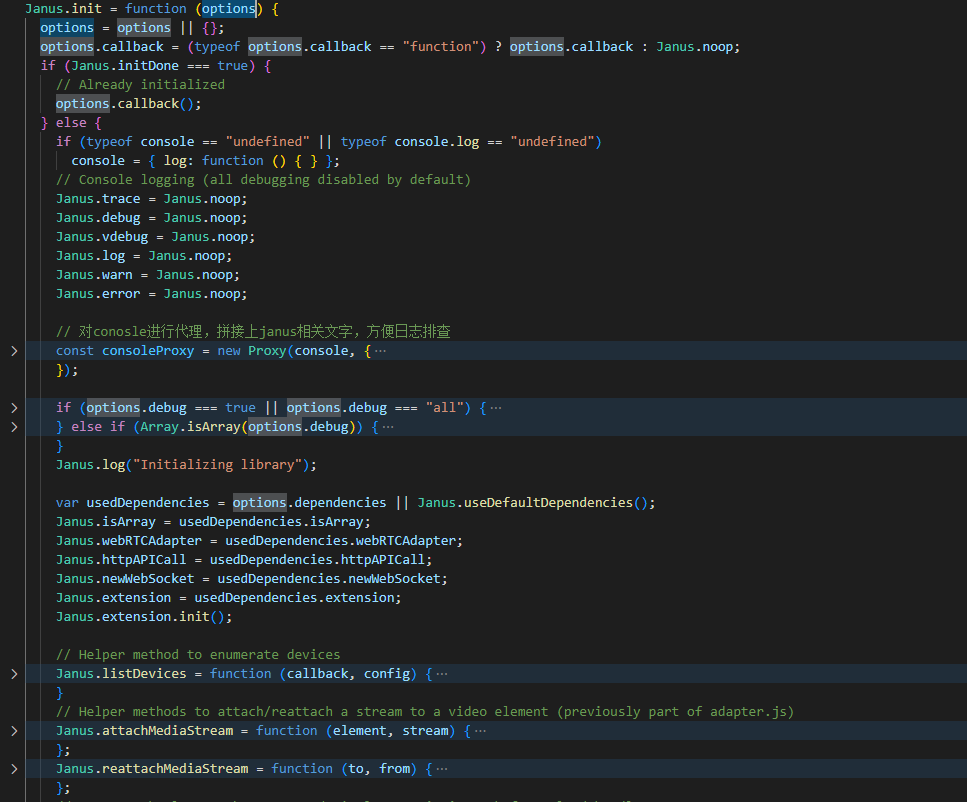
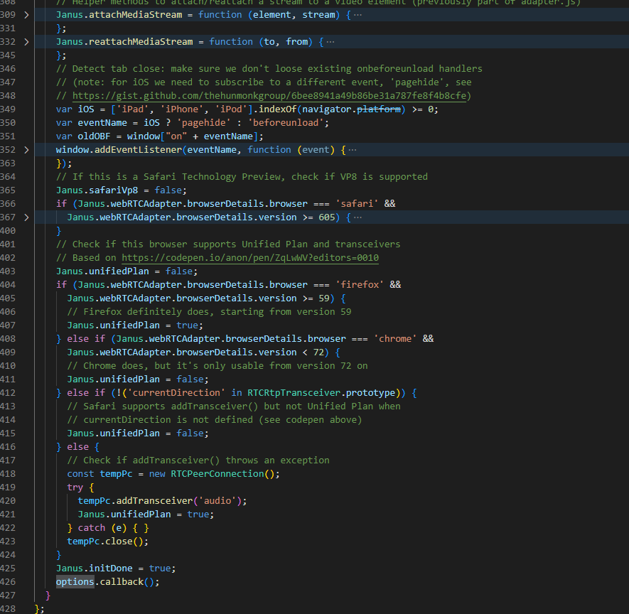
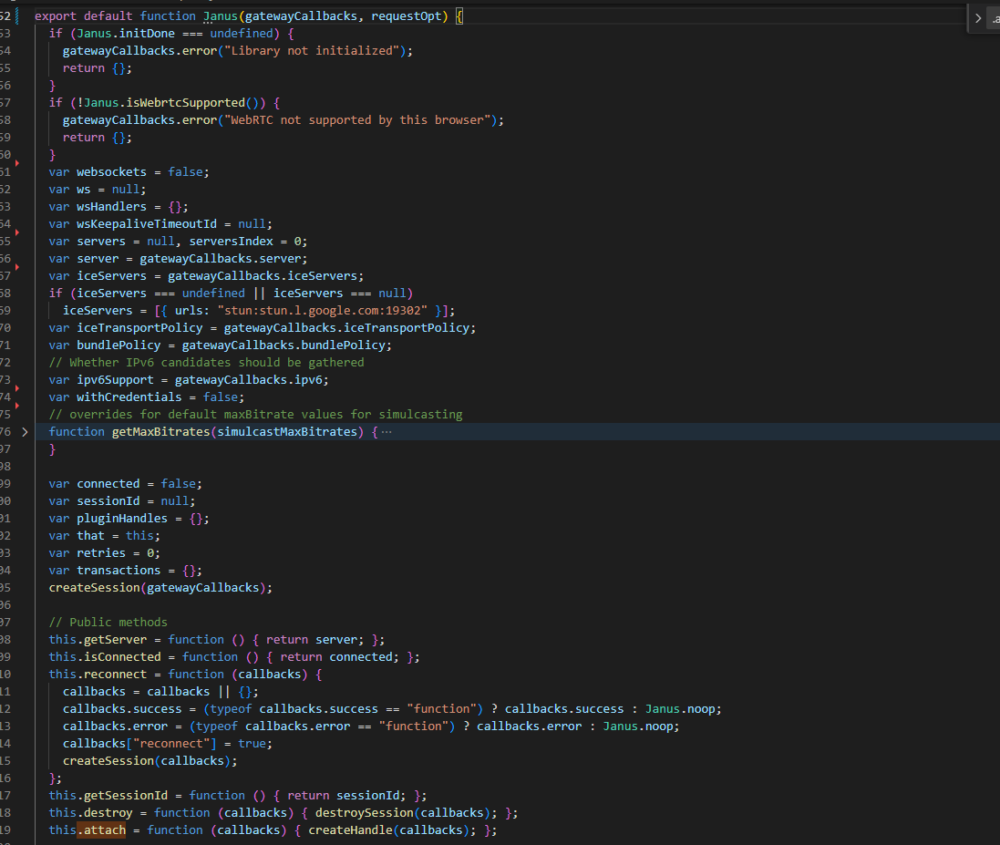
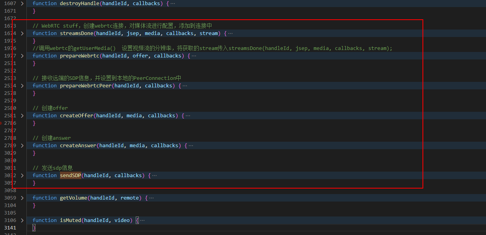

# janus Web源码分析

## 介绍

Janus 是由Meetecho设计和开发的开源、通用的基于SFU架构的WebRTC流媒体服务器，它支持在Linux的服务器或MacOS上的机器进行编译和安装。

### 几种RTC服务器架构

- TURN Server: 转发服务，帮助两个浏览器之间转发媒体数据的服务。这是一种透明转发服务，并不会实现数据缓存，因此当多人会议时，浏览器之间需要传输N*N + N*(N-2)份数据。一般只应用在非常少的通信场景中，比如一对一。
- SFU Server: 选择性转发服务，服务器上有缓存数据，因此浏览器只需要上传一份数据，服务器会复制给其他参会者。目前主要的WebRTC服务器都是SFU服务器，会有N*N份流传输，比TURN少N*(N-2)份上行数据传输，能解决大部分的传输问题。
- MCU Server: 多点控制服务，服务器将会议中的流合并成一路，这样浏览器只需要传输N\*2份数据，上传一路下载一路数据。但由于需要编解码，服务器支持的流的数量比SFU要少一个量级，只有在某些特定场景才会采用。

## 目录结构

Janus github地址：[https://github.com/meetecho/janus-gateway](https://github.com/meetecho/janus-gateway)

对于上面的文件我们可能将它们分成7大模块：

- 核心模块（Core）
- 插件（Plugins）
- 传输（Transports）
- 事件处理（Event Handlers）
- 日志（Loggers）
- 实用工具（Tools and utilities）
- 浏览器相关（html）

### 核心模块（Core）

1、janus.c|h 是janus中最核心的文件，程序的启动，插件的加载，数据的流转都是通过它来实现的。  
2、协议包括 rtp.c|h、rtcp.c|h、rtpsrtp.h、stcp.c|h、sdp.c|h、dtls.c|h、dtls-bio.c|h，这些都是用于处理不同协议的，由于WebRTC使用了很多的协议（如 RTP/RTCP、DTLS、SDP等），因此作为服务端的janus也必须实现这些协议，这样才能与WebRTC进行通信。  
3、其他就是请求认证、配置文件解析、日志、事件处理通知、抓包等一些建立janus.c|h核心模块与其他模块的连接。

### 插件（Plugins）

plugin.c|h 定义了业务插件的接口，通过上面的文件列表，我们看到janus支持的插件包括：  
1、janus_videoroom.c：会议业务插件  
2、janus_videocall.c：1:1视频通讯业务插件  
3、janus_audiobridge.c：音频会议插件  
4、janus_sip.c：sip 业务插件，主要用于与电话业务的互通  
5、janus_lua.c：lua 语言开发插件  
.....等等  
这些插件几乎含盖的所有的业务场景,对于用户来话，要以根据自己的需求选择上面的业务插件进行修改即可完成自己的业务。

### 传输（Transports）

janus支持的信令接口方式很全面，用户可以选择自己喜欢的接入方式进行接入。默认情况下janus使用的是http接口，web端默认就是支持http和websocket。

### 事件处理（Event Handlers）

### 实用工具（Tools and utilities）

录像后处理实用工具

### 浏览器相关（html）

在janus的html目录中有很多文件，其中大部分文件是与上面业务插件中的内容是对应的。基本上一个业务插件就对应一个HTML Demo，我们SDK使用的janus.js也是从这里提供的。

> 关于模块划分，我们也可以参考Janus官网，里面有最新最权威的划分。[Modules](https://janus.conf.meetecho.com/docs/modules.html)

## janus.js源码相关

从大的方面来说，janus.js主要做了两方面的事。

1. 封装了浏览器与janus流媒体服务器之间的业务接口，使得在浏览器端与服务端交互变得简单
2. 对WebRTC的API做了封装，这样用户不用再理会WebRTC底层API该何使用。

整体链路时序图：[mermaid链接](https://mermaid.live/edit#pako:eNrNVmtP21YY_itH_gQSZdwCJJr4sk6aKlWb6KRJU7449gEMybFnO2UMISVQIFxTRko3YLBIUFARIawdBQLNj5mPY3_qX9h7fIJxHOikadqmSHB8Lu_7vM_znMukIKkyFmKCgb9LYyLhh4o4rIupOIkTTdRNRVI0kZhoHIkGGscJZMhjjSOjbGRUJGkj1G_4A8jA-lOss5jj6MHAABqNoUdsoF0hitkyKeNEergNSWIymRClsalWZC8cOMVlbzGdm3VnDmnuF3qwRJc34mTUCzEe8-e3tCK6teOUZ6zzRXo6TS8LtcJhIBXB4zydU93yo5Z2rPcs3qcJ_ZMBmp-2X5Q_XG22GGlJwobxRyaLdV3V4b-MDVNXJ7AMbV4HNBQJP_HaRmucENXESIUPloyWNq2LhTro_E_ufP7D1TIvR9KxaMI6w1BUclPHqBFD1vmqB8reXqGLRfrzIa1c1o6WgG5Dlcaw6VR37NV9FM7kTbJzz-nirnPwiubXVA0TzkQwOgy4mSxPblWLVmUPRg30oM6OUy3AGqDRPsvZ2RNAWyuWnNIenwp57cIZTxLKz3OmoBxxGPO0fqkjIpGT-POnmJgBwYIq-aJY58d10u2NC_vNi4BwMBmUFE1TlEb4YEgtLZkeVggTxpeNKWNCpdBMYVkRbz5UUkfqtZMqmAd0xWLK-9ZxCkrjHa2144VQqUH9vvBKYzRV1kBsXhOdvwZIzaxz7P8J640FbJTBLpwuXgDN79u7z-jJhXNaZAHeVejirzRXrvfnXjrFQ5DmHvXqdYWkY3E237rbvzUk8lI0qRqc0m5gIsNiWjyis7MMx-y-nau6L9_WNp8Br_ZKKST8rZahDRvejjwZi_-YL2nWCAFdWB9U1RTi7DMxCm-ck3dBJP-HPcPKaN4uDBeHRa-m7eN9Du62KoB5WxioWtu7DFFc296F87BWWbd3tv9RwL5N_N13AzqYhi0KAOLE0eerzBHlU3qVYSd_fs3-PUvzG_DXupyDIXd-he6tQB6nWuZ5-IHoZjbd7DozzvG--3rv48bjW_rLoSGsNzkMDo-_9hdnQtMxXH34G5zQTcmdn3e35ujrH63rdVjGZ_CjxXioEsxhahjrkkoIlky4Dfh1FLopPFi1wi4QYshas3G1dCKpGCOBs8yXmZ6_AmZgFfSAQf-2ee_xVnPmu0yWX6PnM6AX7CT7dDrkMzbNC-ZfegG0_4oFP-YLHnfQuxUeGVhrmQTesYam7tYfNRjgK5CWlVd6X7suOdXt2tEJ1AY9WpfGr3JuAaaTZ2579RBoangecUyoAZSMWSnM-oWMfZLlJ_XdeKQkhrtV43j8FZrE0_PdA-DghTH49Wf8hL2HP6SSejBkXS5ZlTMGk_2ENiGF9ZSoyPB6nIwThOKCOYJTOC7EoCnjITGdNONCnEzBVDFtqk8miCTETD2N24S0JoPD649NITYEPoJeeDh-CyfWzST4FGKTwvdCrLMv0t7RG-2GX1dHTyTaFWkTJqC7sz3aF430R_r6e7s6ers7e6bahB-8CF3tnZGenkhPfzTa2R-NdPfCCtjSpqo_5g9e79079Sefb5Ud)

### janus初始化

#### janus.init

##### janus.init方法中主要做的事

1. 封装了日志打印模块
2. janus扩展内容的初始化
3. 绑定了几个自定义的静态方法
4. webRTC的开启方式（planB在规范中已经不再支持）
5. 验证webRTC是否可用。

##### 初始化函数的传参

- debug: 主要定义是否开启日志打印级别
- callback: init初始化后，执行上层回调

### Janus类分析

janus.js整个文件有3000多行代码，但只有一个类，即Janus类。类中实现了很多方法，其中几个关键方法：

### Session相关

Session表示的是一个客户端与janus服务器之间建立的一个信令通道。janus客户端与服务器之间就是通过这个信令通道传输信令的。（可以简单的理解成就是一个websocket连接）

#### 实例化

##### new Janus主要做的事

1. 判断是否初始化，判断是否支持webRTC
2. 定义很多内部变量，在函数内部都可以访问到到,包括 ws（websocket实例）、connected（websocket连接状态）、pluginHandles（句柄列表）、transactions（事务列表）
3. 绑定几个实例方法，包括 isConnected、getSessionId、destroy、attach
4. 执行 createSession 创建本次websocket会话

##### new Janus 实例化的传参

- server：Janus服务器地址
- success：连接成功后执行的回调函数
- error：连接失败后执行的回调函数
- destroyed：连接销毁时的回调函数
  在创建Janus对象时它会调用createSession函数。而在createSession函数内部会通过Janus的类方法服务端建立连接。连接建立成功后，会回调success函数。

#### createSession

> createSession其实做的事就是建立websocket连接，绑定ws的监听事件，通过 handleEvent 函数，定义消息的所有类型（在信令处理中会说明）。

1. 创建了一个JSON对象request，准备后面连接建立后发送create消息，然后判断是否是websocket连接，进入到websocket的逻辑处理分支。
2. 通过Janus.newWebSocket方法与server（janus服务器）建立连接，然后绑定websocket的监听事件。

1. 连接建立后，janus首先在transctons中创建一个新的transaction，然后将之前准备好的request发送给服务器，确认websocket是否可以正常进行信令通信。
2. 服务器收到消息后，进行逻辑处理后，会返回消息给websocket，触发我们绑定的message事件
3. 在message事件中，对所有接收到的服务端的消息都由handleEvent函数进行处理。在open事件中添加的transaction，会在ack消息中被触发，从而调用上层传入的success回调事件，暴露sessionId出去。

#### destroySession

> destroySession 主要就是做的一个销毁操作，发送destroy消息给服务器，同时解除之前绑定的websocket事件，销毁句柄列表。

### 信令处理

janus信令处理的简化架构图：  

#### 客户端接收消息

  
  

> 对message传递的消息，统一都是通过handleEvent函数进行处理的  

handleEvent函数中，会对消息类型做判断，根据不同的类型做不同的处理。它能处理的消息包括以下几种:
- keepalive：websocket心跳消息
- ack：确认消息。服务端并不会等事物处理完再返回结果，而是接收到事物消息后，先给客户端回了一个ack，表示确认服务端已经收到该消息了，再异步执行业务逻辑
- success：消息处理成功。该消息与 ack 消息是类似的，当服务器完成了客户端的命令后会返回该消息
- trickle：收集候选者用的消息。里边存放着candidate，janus.js收到该消息后，需要将Candidate解析出来，每解析出一个candidate，就会发送消息给服务端，从而提升收集速度
- webrtcup：表示一个peer上线了，此时要找到以应的业务插件（plugin）做业务处理
- hangup：用户挂断，找到对应的plugin，进行挂断操作
- detached：某个插件要求与Janus Core之间断开连接
- media：服务的那有（无）接收到媒体流
- slowlink：限流，丢包
- error：错误消息
- event：插件发布的事件消息
- timeout：超时

对于janus来讲，上面这些消息有些是不需要再做处理的，有些是需要修改状态的，还有一些是与业务插件有关的，需要交由pluginHandle做进一步处理。

#### 客户端发送消息

在创建插件句柄 pluginHandle 的时候，为上层应用封装了一个发送消息的方法，即pluginHanlde.send()，这个函数实际调用的是janus的sendMessage方法：

1. 在sendMessage中其实就是构造request对象，request对象中会包含对应的handle_id，然后将构造好的request消息通过websocket发送出去。  
2. 消息发送给janus服务器，服务器处理好后又会给客户端返回消息。消息返回到客户端后，又会触发websocket的message事件，这样就又回到了我们上面介绍的handleEvent处理函数。

带有handle_id的具体的消息例子：  

### Plugin插件相关

#### 其中createHandle主要做的事

1. 上层应用通过调用janus.attach方法，执行createHandle函数，绑定传入的所有回调函数
2. createHanlde函数中会去构造request对象，将 transaction 放到 transactions 队列中，通过websocket往服务器发送attach消息，服务器为客户端返回一个插件id。
3. 根据创建时的 transaction 事物，执行transactions事物队列中的函数，生成一个pluginHandle对象，将 pluginHanle 放到 pluginHandles 队列中，并让该对象与janus服务端的对应插件关联，返回给上层。
4. 根据创建时的 handle_id 在事件回调中找到对应插件，执行上层传入的回调任务。

上面的字段就是pluginHandle对象的一些重要信息，在这些信息中包括了两个部分，基础信息部分和WebRTC信息部分。

session中保存的是janus核心类对象；plugin指明我们要与服务端哪个插件建立联接，例如vidoeroom插件；token用于安全访问；detached表明是否已经与服务端对应的plugin建立了联系。

webrtcStuff是与webrtc相关的参数，mySdp中保存的是本地SDP信息；mediaConstrains存放用于采集音视频数据的限制参数；pc表示PeerConnection实例；trickle指明在使用WebRTC时是否使用trickle机制；iceDone表明是否ICE建立成功了。

pluginHanle对象中提供的函数，主要包括提供工具函数、发送自定义消息、传输数据、执行webRTC对等连接、销毁插件，以及监听webRTC事件与状态变化，上报上层等。

上层调用示例，其中的各属性含义：

- plugin：要绑定的janus插件，这里要绑定插件为janus.plugin.videoroom。
- opaqueId：一个随机值，插件的唯一ID。
- success：attach方法执行成功后的回调函数，在服务端返回ack信令后执行。
- error：attach方法执行失败后的回调函数。
- iceState：webRTC ice状态变更，可以通过该函数更新ICE状态。
- mediaState：媒体状态更新，后端返回media信令后会执行。
- webrtcState：更改WebRTC状态的回调函数。
- onmessage：收到websocket event事件后执行的回调。
- onlocalstream：收到本地流时的回调函数。
- onremotestream：收到远端流时的回调函数。
- oncleanup：销毁时的回调函数

#### destroyHandle 销毁插件

##### 触发场景：

1. 当上层调用 pluginHandle.detach
2. 当上层调用 janus.destroy 执行 destroySession 函数
3. 接受到服务端返回的 detached 消息，内部执行 pluginHandle.detach

##### 主要做的事：

1. 根据handleId，调用 cleanupWebrtc 销毁 pc 实例
2. 如果没有 pluginHandle 了，则回调上层 success，否则往后执行
3. 发送 detach 消息，通知服务器，插件销毁，可以释放资源了（套娃）

### webRTC相关

webRTC相关的方法比较多，其中最核心的是 prepareWebrtc、streamsDone、createOffer、prepareWebrtcPeer, cleanupWebrtc 五个函数，包括采集媒体数据，创建 PeerConnection 实例，将采集到的媒体流绑定在实例上，并按照webRTC的规范进行媒体协商，收集candidate候选人，与远端服务器建立连接，以及销毁p2p连接

#### prepareWebrtc主要做的事

> 建立webRTC之前的准备工作，根据上层传递的约束条件，采集媒体，获取到媒体流，向下传递给 streamsDone 函数

1. 根据媒体采集类型，执行不同逻辑分支
2. 设置 gumConstraints 媒体约束条件，调用webrtc的getUserMedia()获取 MediaStream 流对象
3. 将采集到的媒体对象传入 streamsDone 中，进行后续的连接传输

#### streamsDone主要做的事

1. 判断当前pluginHandle是否存在peerconnection实例，没有则实例化，有则走音视频轨道更新逻辑
2. 将获取到的流存储到pluginHandle上，回调上层 onlocalstream 方法，上层获取到本地流并展示
3. 在pc实例化后，绑定ice、媒体轨道的监听事件
4. 遍历MediaStream流对象，对音视频轨道进行约束条件修改，最后调用 addTransceiver 将媒体轨道添加到 pc 上
5. 执行 createOffer 方法

#### createOffer主要做的事

1. 特殊情况下，修改添加在pc对象上的媒体轨道信息，这也是传输前最后一次修改了
2. 调用pc对象的createOffer方法，生成本地媒体描述信息sdp，并收集ice候选人
3. 回调上层 customizeSdp 方法，可以自定义修改 sdp 信息（可选）
4. setLocalDescription 设置本地媒体描述信息，并回调上层success方法，上层的回调里这个时候一般会执行pluginHandle的send方法，调用sendMessage，将sdp通过websocket发送给服务器，告知服务器可以建立p2p连接了

#### prepareWebrtcPeer 主要做的事

> prepareWebrtcPeer 其实只做了一件事件，就是设置远端媒体信息，并且只有一个地方会使用到，就是上层调用 pluginHandle.handleRemoteJsep 的时候。

1. 接收到上层带来的jsep参数，jsep就是远端的sdp信息，在我们的架构下则是添加了服务器的地址的sdp信息。
2. 调用 setRemoteDescription 将jsep设置为远端媒体信息，此时p2p连接正式建立，端与服务器之间开始流的推送。

#### cleanupWebrtc 主要做的事

> 在接收到服务端发送的 hangup 消息，或者调用 destroyHandle 方法时（一般上层主要调用pluginHandle.detach进行插件的注销），都会触发webRTC的销毁。

1. 根据handleId找到对应插件，重置 webrtcStuff 的数据
2. 对媒体流的轨道进行遍历，都执行 stop，随后调用 pc.close 关闭 peerconnection 连接，在 chrome webRTC调试工具中可以看到连接状态变更为 closed
3. 回调上层 oncleanup 事件
