# janus Web源码分析

## 介绍

Janus 是由Meetecho设计和开发的开源、通用的基于SFU架构的WebRTC流媒体服务器，它支持在Linux的服务器或MacOS上的机器进行编译和安装。

### 几种RTC服务器架构

- TURN Server: 转发服务，帮助两个浏览器之间转发媒体数据的服务。这是一种透明转发服务，并不会实现数据缓存，因此当多人会议时，浏览器之间需要传输N*N + N*(N-2)份数据。一般只应用在非常少的通信场景中，比如一对一。
- SFU Server: 选择性转发服务，服务器上有缓存数据，因此浏览器只需要上传一份数据，服务器会复制给其他参会者。目前主要的WebRTC服务器都是SFU服务器，会有N*N份流传输，比TURN少N*(N-2)份上行数据传输，能解决大部分的传输问题。
- MCU Server: 多点控制服务，服务器将会议中的流合并成一路，这样浏览器只需要传输N\*2份数据，上传一路下载一路数据。但由于需要编解码，服务器支持的流的数量比SFU要少一个量级，只有在某些特定场景才会采用。

## 目录结构

Janus github地址：[https://github.com/meetecho/janus-gateway](https://github.com/meetecho/janus-gateway)

对于上面的文件我们可能将它们分成7大模块：

- 核心模块（Core）
- 插件（Plugins）
- 传输（Transports）
- 事件处理（Event Handlers）
- 日志（Loggers）
- 实用工具（Tools and utilities）
- 浏览器相关（html）

### 核心模块（Core）

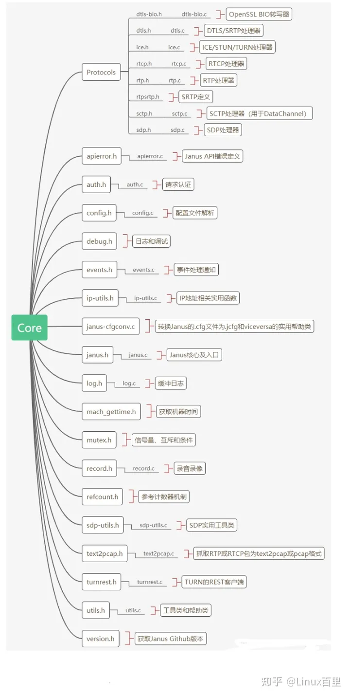

1、janus.c|h 是janus中最核心的文件，程序的启动，插件的加载，数据的流转都是通过它来实现的。  
2、协议包括 rtp.c|h、rtcp.c|h、rtpsrtp.h、stcp.c|h、sdp.c|h、dtls.c|h、dtls-bio.c|h，这些都是用于处理不同协议的，由于WebRTC使用了很多的协议（如 RTP/RTCP、DTLS、SDP等），因此作为服务端的janus也必须实现这些协议，这样才能与WebRTC进行通信。  
3、其他就是请求认证、配置文件解析、日志、事件处理通知、抓包等一些建立janus.c|h核心模块与其他模块的连接。

### 插件（Plugins）

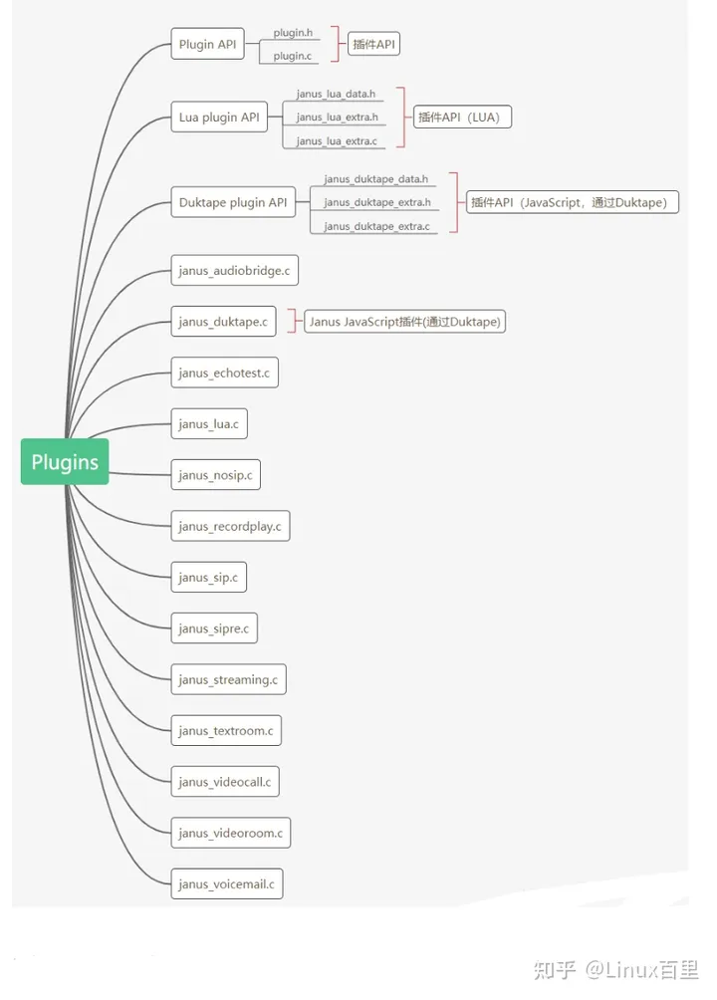

plugin.c|h 定义了业务插件的接口，通过上面的文件列表，我们看到janus支持的插件包括：  
1、janus_videoroom.c：会议业务插件  
2、janus_videocall.c：1:1视频通讯业务插件  
3、janus_audiobridge.c：音频会议插件  
4、janus_sip.c：sip 业务插件，主要用于与电话业务的互通  
5、janus_lua.c：lua 语言开发插件  
.....等等  
这些插件几乎含盖的所有的业务场景,对于用户来话，要以根据自己的需求选择上面的业务插件进行修改即可完成自己的业务了。

### 传输（Transports）

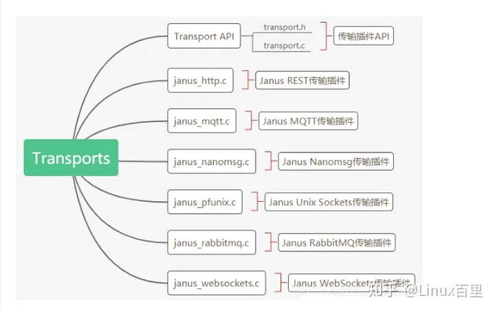

janus支持的信令接口方式还是蛮全的，用户可以选择自己喜欢的接入方式进行接入。通过上面的描述你应该很容易判断出每个文件的作用，你对那个感兴趣就可以专门看那个文件。默认情况下janus使用的是http接口，因此该接口也是最成熟的，web端默认就是支持http和websocket。

### 事件处理（Event Handlers）

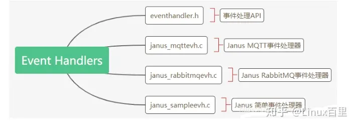

### 实用工具（Tools and utilities）

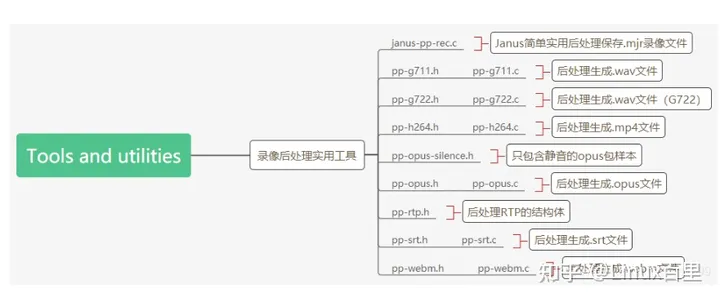

录像后处理实用工具

### 浏览器相关（html）

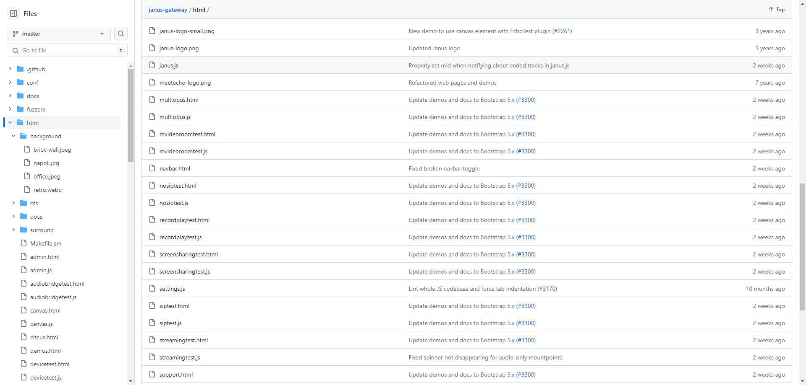

在janus的html目录中有很多文件，其中大部分文件是与上面业务插件中的内容是对应的。基本上一个业务插件就对应一个HTML Demo，我们SDK使用的janus.js也是从这里提供的。

> 关于模块划分，我们也可以参考Janus官网，里面有最新最权威的划分。[Modules](https://janus.conf.meetecho.com/docs/modules.html)

## janus.js源码相关

从大的方面说，janus.js主要完成两方面的事儿。一是封装了浏览器与janus流媒体服务器之间的业务接口，使得在浏览器端开发音视频会议系统变得特别简单；二是对WebRTC的API做了封装，这样用户不用再理会WebRTC底层API该何使用了。

### Janus类分析

janus.js整个文件有3000多行代码，但只有一个类，即Janus类。类中实现了很多方法，其中几个关键方法如下：

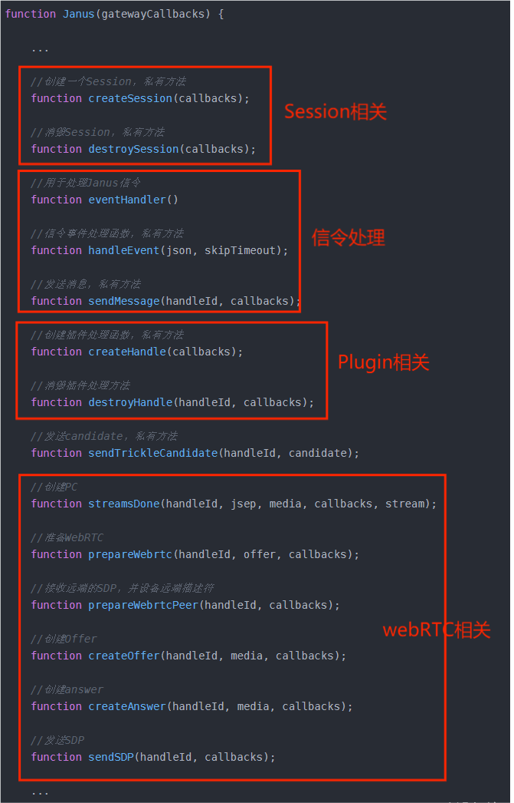

### Session相关

Session表示的是一个客户端与janus服务器之间建立的一个信令通道。janus客户端与服务器之间就是通过这个信令通道传输信令的。（可以简单的理解成就是一个websocket连接）

#### createSession

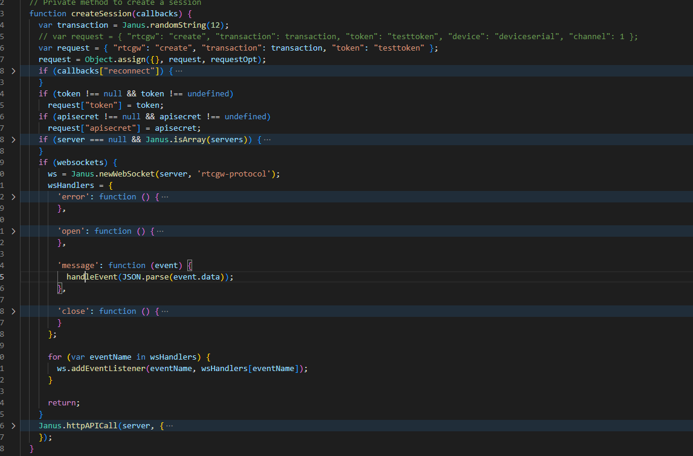

在createSession中，首先创建了一个JSON对象request，然后判断是否是websocket连接，进入到websocket的逻辑处理分支。通过Janus.newWebSocket方法与server（janus服务器）建立连接，然后绑定websocket的监听事件。

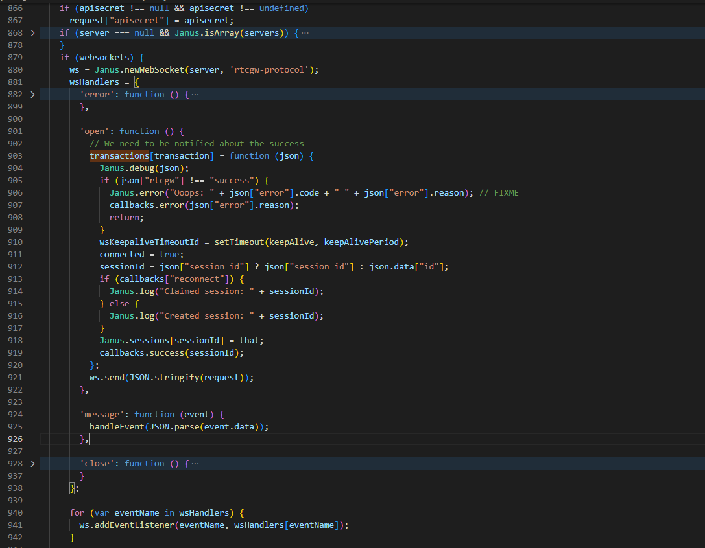

连接建立后，janus.js首先在transctons中创建一个新的transaction，然后将之前准备好的request发送给服务器，确认websocket是否可以正常进行信令通信。  
服务器收到消息后，进行逻辑处理后，会返回消息给websocket，触发我们绑定的message事件，在message事件中，对所有接收到的服务端的消息都由handleEvent函数进行处理。在open事件中添加的transaction，会在ack消息中被触发，从而调用上层传入的success回调事件，暴露sessionId出去。

#### destroySession

destroySession 主要就是做的一个销毁操作，发送destroy消息给服务器，同时解除之前绑定的websocket事件。  
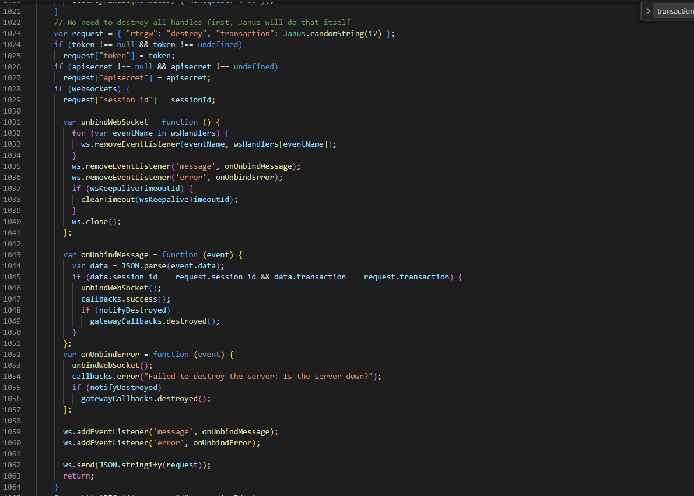

### 信令处理

Janus信令处理的简化架构图：  
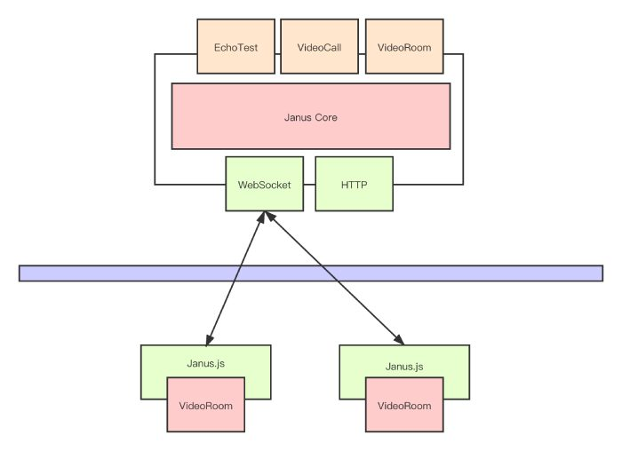

#### 服务端处理

服务端的信令处理主要是通过 transports 模块来实现的，transports中包括很多插件，图中展示的websocket和http就是其中的两个。  
这两个transport插件是在janus服务启动时加载起来的。以websocket插件为例，当该插件被加载后，websocket服务随即开启。此时，客户端就可以向该websocket服务发送消息了，同时janus.js也可以通过websocket连接接收来自服务端的信息。

#### 客户端接收消息

客户端处理在session相关中已经提到，对message传递的消息，统一都是通过handleEvent函数进行处理的。

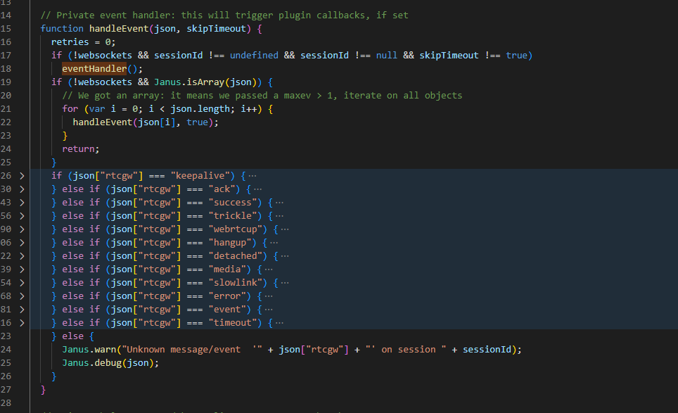  
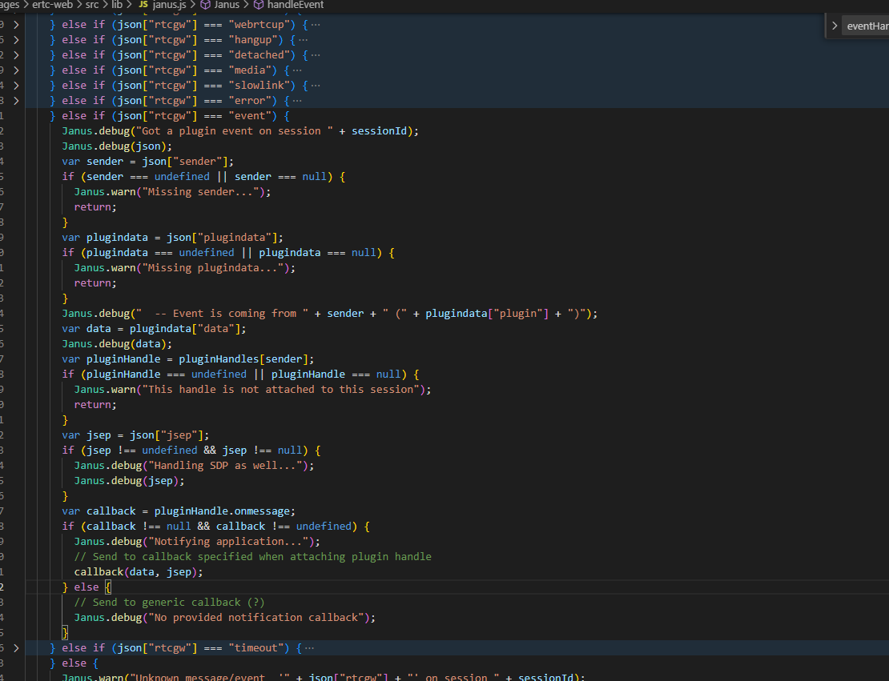

handleEvent处理逻辑就如上面所示，对消息类型做判断，根据不同的类型做不同的处理。它能处理的消息包括以下几种:

- keepalive：websocket心跳消息
- ack：确认消息。服务端并不会等事物处理完再返回结果，而是接收到事物消息后，先给客户端回了一个ack，表示确认服务端已经收到该消息了，再异步执行业务逻辑
- success：消息处理成功。该消息与 ack 消息是类似的，当服务器完成了客户端的命令后会返回该消息
- trickle：收集候选者用的消息。里边存放着candidate，janus.js收到该消息后，需要将Candidate解析出来，每解析出一个candidate，就会发送消息给服务端，从而提升收集速度
- webrtcup：表示一个peer上线了，此时要找到以应的业务插件（plugin）做业务处理
- hangup：用户挂断，找到对应的plugin，进行挂断操作
- detached：某个插件要求与Janus Core之间断开连接
- media：服务的那有（无）接收到媒体流
- slowlink：限流，丢包
- error：错误消息
- event：插件发布的事件消息
- timeout：超时

对于janus.js来讲，上面这些消息有些是不需要再做处理的，有些是需要修改状态的，还有一些是与业务插件有关的，需要交由pluginHandle做进一步处理。

#### 客户端发送消息

在janus.js中创建插件句柄的时候，为上层应用封装了一个发送消息的方法，即pluginHanlde.send()，这个函数实际调用的是janus的sendMessage方法：  

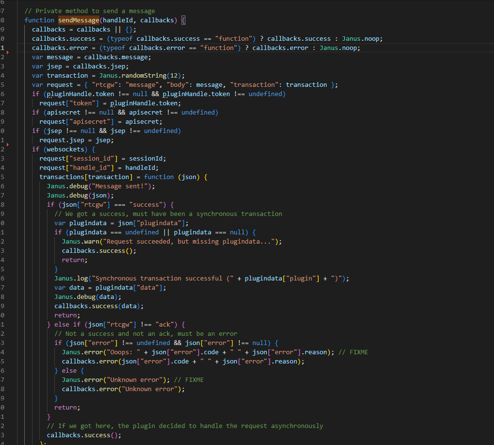

在sendMessage中其实就是构造request对象，request对象中会包含对应的handle_id，然后将构造好的request消息通过websocket发送出去。  
消息发送给janus服务器，服务器处理好后又会给客户端返回消息。消息返回到客户端后，又会触发websocket的message事件，这样就又回到了我们上面介绍的handleEvent处理函数。  

带有handle_id的具体的消息例子如下：  
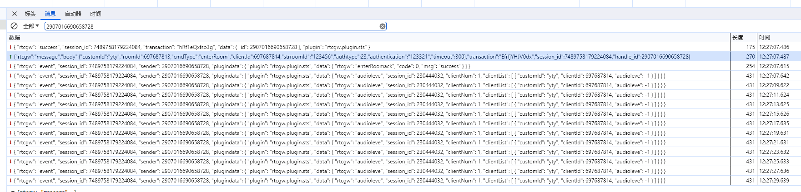
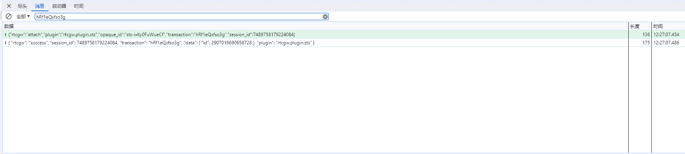  

### Plugin插件相关
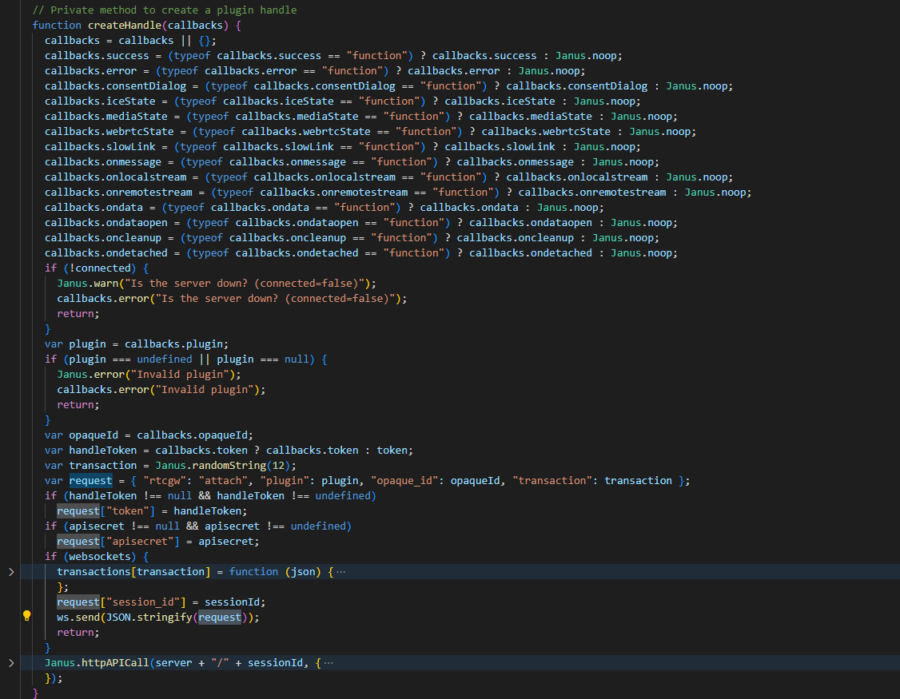 

在janus.js中，Plugin相关函数的如上，其中createHandle的执行逻辑主要是：
1、上层应用通过调用janus.attach方法，执行createHandle函数
2、createHanlde函数中会去构造request对象，将 transaction 放到 transactions 队列中，通过websocket往服务器发送attach消息，服务器为客户端返回一个插件id。
3、根据创建时的 transaction 事物，执行transactions事物队列中的函数，生成一个pluginHandle对象，将 pluginHanle 放到 pluginHandles 队列中，并让该对象与janus服务端的对应插件关联，返回给上层。
4、根据创建时的 handle_id 在事件回调中找到对应插件，执行上层传入的回调任务。

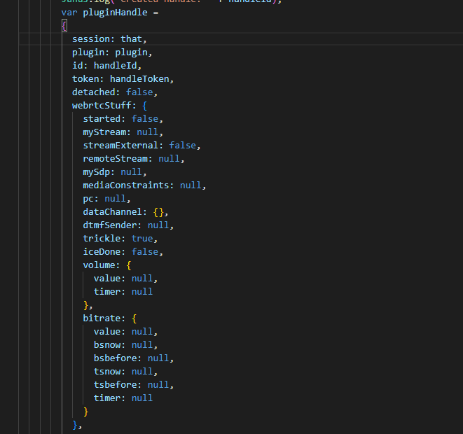   

上面的字段就是pluginHandle对象的一些重要信息，在这些信息中包括了两在部分，基础信息部分和WebRTC信息部分。

session中保存的是janus核心类对象；plugin指明我们要与服务端那个个插件建立联接，例如vidoeroom插件；token用于安全访问；detached表明是否已经与服务端对应的plugin建立了联系。

webrtcStuff是与webrtc相关的参数，mySdp中保存的是本地SDP信息；mediaConstrains存放用于采集音视频数据的限制参数；pc表示PeerConnection实例；trickle指明在使用WebRTC时是否使用trickle机制；iceDone表明是否ICE建立成功了。

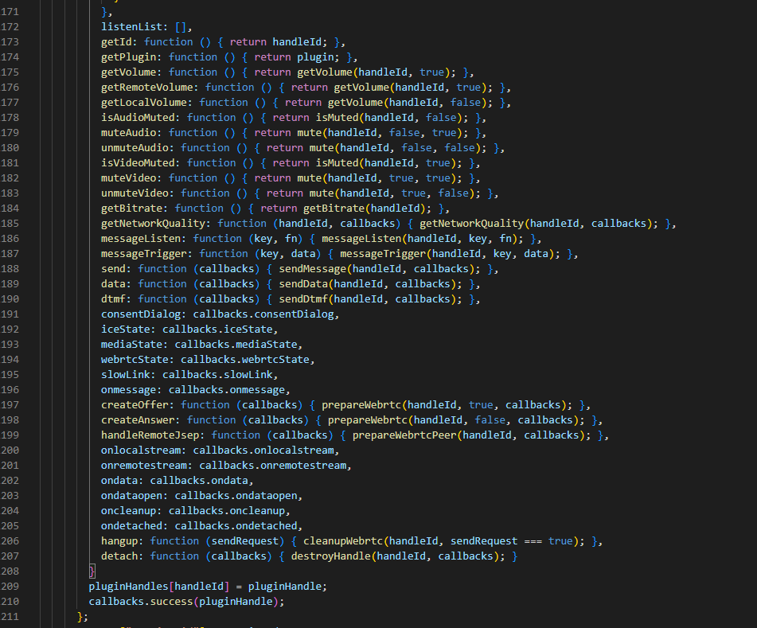   

pluginHanle对象中提供的函数，主要包括提供工具函数、发送自定义消息、传输数据、执行webRTC对等连接、销毁插件，以及监听webRTC事件与状态变化，上报上层，具体内容在webRTC相关模块中展开。

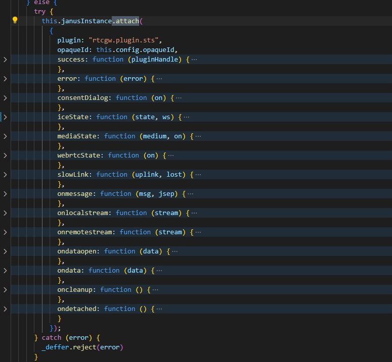  

上层调用示例如上，其中的各属性含义：
- plugin：要绑定的janus插件，这里要绑定插件为janus.plugin.videoroom。
- opaqueId：一个随机值，插件的唯一ID。
- success：attach方法执行成功后的回调函数，在服务端返回ack信令后执行。
- error：attach方法执行失败后的回调函数。
- iceState：webRTC ice状态变更，可以通过该函数更新ICE状态。
- mediaState：媒体状态更新，后端返回media信令后会执行。
- webrtcState：更改WebRTC状态的回调函数。
- onmessage：收到websocket event事件后执行的回调。
- onlocalstream：收到本地流时的回调函数。
- onremotestream：收到远端流时的回调函数。
- oncleanup：销毁时的回调函数

### webRTC相关
待补充